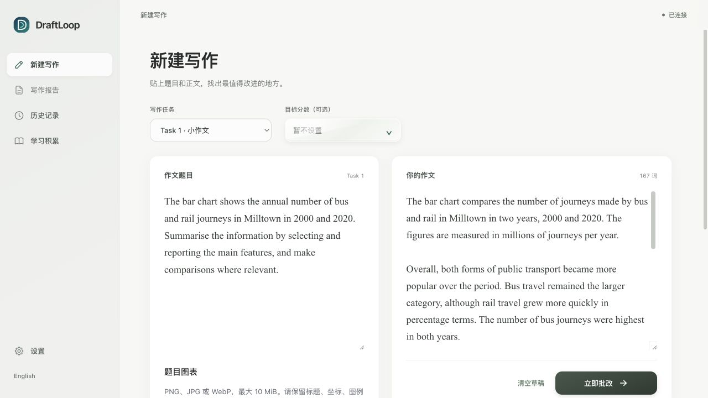
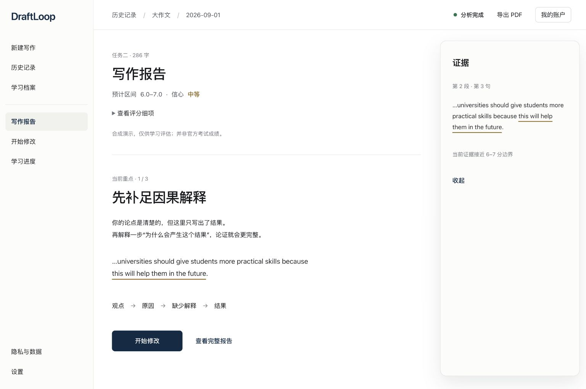
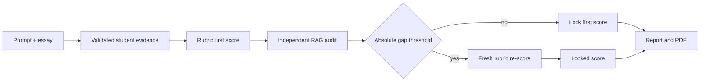

# DraftLoop

DraftLoop is a Chinese-first IELTS Academic Writing workspace. A learner submits a prompt and an essay, sees where the evidence came from, revises one issue at a time, and can export the finished report as a PDF.

This repository is a portfolio build. The score is an internal estimate for learning, not an IELTS result and not a substitute for an official examiner.

## Product preview

The current showcase includes two real UI captures from the DraftLoop review
surface. The writing studio keeps the prompt and essay visible together; the
report view turns the locked score and evidence-linked revision priorities into
an actionable next draft.



*Writing studio: enter the task prompt and essay side by side before review.*



*Writing report: inspect a focused revision priority with the supporting evidence.*

## What the project demonstrates

- A two-pane writing studio with the task on the left and the submitted essay on the right.
- Criterion-by-criterion scoring for Task 1 and Task 2, with the original evidence kept next to every finding.
- A report that separates rewrite suggestions from deep correction. It can show paragraph analysis, sentence-level edits, topic notes, and a next practice plan.
- A rubric-first scoring pipeline with a separate RAG calibration audit. The audit can challenge a score, but it cannot silently replace it.
- Local model configuration, privacy export and deletion, resumable browser work, and PDF generation.
- A React and TypeScript client backed by a small Python application boundary. The same contracts are used by the local browser surface and the macOS shell.

## Scoring and RAG audit

The first score is produced from the official rubric and validated evidence from the current essay. A separate audit then retrieves the most relevant calibration evidence and asks the model to review that first score independently.

The gate compares the absolute difference:

```text
gap = abs(first_rubric_score - rag_audit_score)
```

For a first score of 7.0 or higher, `gap >= 0.5` starts a fresh rubric re-score. Below 7.0, the trigger is `gap > 0.5`. A triggered re-score receives the rubric, current student evidence, the first score and reasons, valid RAG evidence, and the concrete disagreements. It makes a new rubric decision. The system never averages the two scores and never copies the audit score over the rubric score. If the gate does not fire, the first rubric score is locked.



## Product walkthrough

1. Choose Task 1 or Task 2 and enter the prompt. Task 1 also accepts a chart image.
2. Paste the essay into the right-hand editor and start a review.
3. Read the evidence-linked score. The report keeps the learner's sentence visible before showing the suggested change.
4. Use the rewrite page for the few issues most likely to move the target band. Open deep correction for paragraph-by-paragraph analysis and a correction table.
5. Submit a revision, then download the report when the validation checks are complete.

## Run it locally

The complete review flow runs locally. It needs Python for the application service and Node.js for the React build.

```bash
python3 -m venv .venv
.venv/bin/python -m pip install -r requirements-lock.txt
npm ci --prefix frontend
cp .env.example .env
bash scripts/run_web.sh
```

Open `http://127.0.0.1:4174/`. The environment template is intentionally blank. Add a provider URL, model ID and key only in your local `.env` file. `.env`, local RAG packages, browser history, generated reports and private submissions are ignored by Git.

For the Python desktop entry point:

```bash
.venv/bin/python -m app.main
```

To package the current web workspace as a macOS app:

```bash
bash scripts/make_desktop_app.sh
open dist/DraftLoop.app
```

The bundle starts the same local-only Python service as the browser build and
opens it inside a hardened WebEngine shell. User data stays in
`~/Library/Application Support/DraftLoop`; the bundle contains no API keys or
model credentials.

## Verification

The checks used for this portfolio build are:

```bash
.venv/bin/python -m unittest discover -s tests -q
npm run typecheck --prefix frontend
npm test --prefix frontend
```

The Python suite is self-contained and does not send real provider requests. The live flow still needs a model configuration in your local environment.

## Repository map

```text
app/                    Python domain, scoring, RAG audit and PDF services
frontend/src/           React writing studio, model settings and report UI
app/resources/          Rubric pins, schemas and rights-safe demo fixtures
docs/portfolio/         The short product case study and bad-case notes
scripts/                Local run and validation commands
tests/                  Contract and integration tests
```

The old Electron prototype and generated design previews are deliberately left out of the public release. They are not required to run the current web product and would make the repository harder to read.

## Design notes

The interface follows the approved "double-page handout plus academic report" direction: warm paper, navy navigation, Songti for Chinese and Times New Roman for English, fine rules, and explicit evidence labels. See [DESIGN.md](DESIGN.md) and the [portfolio case study](docs/portfolio/case-study.md) for the decisions behind the current screens.

## Data and credentials

The repository contains no real API keys, model credentials, user essays, private RAG corpus, or generated reports. Provider settings are read from the local environment or the local settings store. `app/resources/demo/c3-synthetic-submission.json` is synthetic, labelled as such, and is not an official exam script.

## License

This is a portfolio and demonstration repository. No open-source license is granted at this time.
