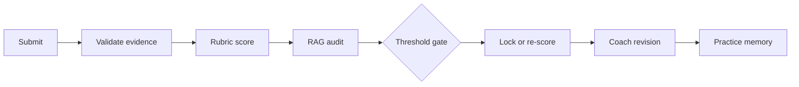

# DraftLoop portfolio case study

## The problem

Most writing checkers return a number and a long block of generic advice. That is hard to act on. A learner cannot tell which sentence caused the deduction, whether a suggestion is grounded in the rubric, or what to practise next.

DraftLoop treats a writing review as a loop rather than a one-time score:



The learner keeps the original essay in view throughout the loop. The product points to a word, sentence, paragraph, or missing support before it gives a rewrite.

## Product decisions

### Two pages instead of a dashboard

The writing screen puts the task on the left and the essay on the right. This matches the learner's actual job: read the question, write, and compare. The report uses a paper-like spread with a narrow contents rail, a score strip, and correction tables. Warm paper, navy structure, Songti Chinese, and Times New Roman English make the report read like a study handout rather than a generic admin dashboard.

### Suggestions with a locator

Each issue carries an evidence locator. The UI can show the original phrase, the revised phrase, and the reason for the change. The rewrite page stays short and prioritised. The deep-correction page is where the learner can inspect paragraph logic, examples, grammar, and topic vocabulary in detail.

### Separate score authority from coaching

The score is locked before coaching content is generated. Revision help, topic memory, and an AI-assisted rewrite cannot increase the score or count as independent mastery. This separation keeps the report useful even when a model response is incomplete.

## RAG calibration decision

RAG is evidence for review, not a second authority. The initial model receives only the official rubric and validated evidence from the current essay. The audit model receives retrieved calibration evidence and reviews the initial judgement without seeing the learner's history or a target band.

```text
gap = abs(initial rubric score - RAG audit score)

initial >= 7.0 and gap >= 0.5  -> re-score
initial <  7.0 and gap >  0.5  -> re-score
otherwise                       -> accept initial rubric score
```

When the gate opens, the new model sees the rubric, the validated essay evidence, the first score and its reasons, the retrieved evidence, and a list of the disagreements. It must score from the rubric again. Averaging the two scores or copying the audit is intentionally disallowed. A failed audit or re-score remains visible as a review state instead of becoming a fabricated final result.

## Bad-case notes

The following cases shaped the current contracts and tests.

| Bad case | What could go wrong | Product response |
| --- | --- | --- |
| Generic feedback | "Improve LR" gives the learner no edit to make. | Show the exact phrase, sentence, paragraph, and a reason tied to the criterion. |
| RAG score copied over the first score | A retrieved example becomes an unexamined authority. | Keep an independent audit, compare absolute gap, and start a new rubric re-score only at the threshold. |
| High score with a small disagreement | A 7.0 result can hide a meaningful half-band error. | Use the inclusive `>= 0.5` rule at 7.0 and above. |
| AI rewrite treated as learner mastery | A polished sentence could be mistaken for the learner's own ability. | Label assistance, preserve the original, and keep mastery events separate from assisted edits. |
| Missing evidence | A broken locator or incomplete provider response can look like a normal report. | Fail closed with `REVIEW_REQUIRED`; do not export a normal final report. |
| Private data in a public build | Essays, API keys, or local RAG packages reach GitHub. | Keep credentials and runtime paths out of the tree, provide only `.env.example`, and scan the release tree before upload. |

## Implementation notes

The browser surface is a React and TypeScript client. Python owns the application services, scoring contracts, RAG audit, persistence boundary, privacy operations, and PDF artifact. The frontend receives projections rather than recalculating scores. Tests cover the rubric gate, evidence locators, provider recovery, privacy behavior, browser reports, learning flows, and the report UI.

The repository keeps decisions that are useful to a reviewer in `docs/adr/`. Runtime history, local provider settings, private RAG packages, generated PDFs, and design preview exports stay outside the public release.

## What I would do next

The next product step is a small consented beta with real learner sessions. I would measure whether learners can find the sentence behind a deduction, whether the rewrite page leads to a second submission, and where the RAG audit disagrees with the first score. Those results should decide which report sections stay visible by default.
